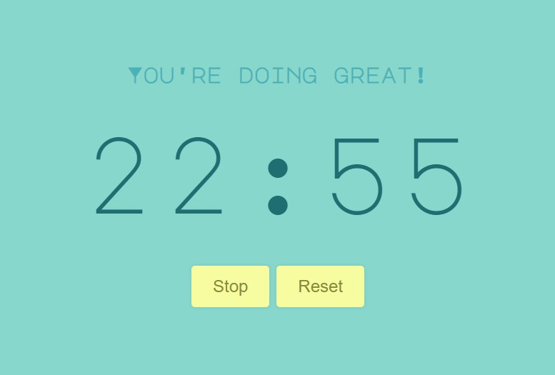

# Developer Profile

## Table of contents

- [Overview](#overview)
  - [The challenge](#the-challenge)
  - [Screenshot](#screenshot)
  - [Links](#links)
- [My process](#my-process)
  - [Built with](#built-with)
  - [What I learned](#what-i-learned)
  - [Continued development](#continued-development)
- [Author](#author)

## Overview

### The challenge

Users should be able to:

- View the optimal layout for the app depending on their device's screen size
- Will see a countdown timer starting from 25 minutes
- There is a button to start and restart timer
- There is a button to stop the timer
- There is a button to reset the timer

### Screenshot

### Links

- Live Site URL: [View](https://pomodoro3.netlify.app/)

## My process

- This React component implements a countdown timer application with start, stop, and reset functionalities using React's state management and useRef hook for maintaining the timer interval reference.
- The component manages states for title to display different messages based on the timer's status, timeLeft to track the remaining time in seconds, and isRunning to control the timer's active state.
- When the "Start" button is clicked, it initiates the countdown by setting up an interval that decrements timeLeft every second until it reaches zero.
- The UI renders buttons dynamically based on the timer's state, displaying "Start" when the timer is stopped and "Stop" when it's running, alongside a "Reset" button to restart the timer.
- The countdown display is formatted using a padTime function to ensure consistent leading zeros for minutes and seconds.

### Built with

- Semantic HTML5 markup
- CSS custom properties
- Mobile-Responsive Design
- JavaScript - Scripting language
- [React](https://reactjs.org/) - JS library

### What I learned

This was a teston knowledge of components and props.

### Continued development

Maybe used for reference.

## Author

- Website - [Cameron Howze](https://camkol.github.io/)
- Frontend Mentor - [@camkol](https://www.frontendmentor.io/profile/camkol)
- GitHub- [@camkol](https://github.com/camkol)
- LinkedIn - [@cameron-howze](https://www.linkedin.com/in/cameron-howze-28a646109/)
- E-Mail - [cameronhowze4@outlook.com](mailto:cameronhowze4@outlook.com)
